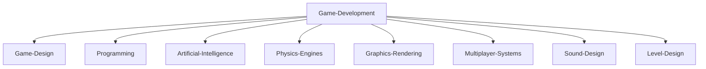

<!--   my-icons -->
<p align="center">
    <a href="https://github.com/mahmudnibir/mahmudnibir"></a>
    <a href="https://github.com/mahmudnibir/mahmudnibir"></a>
    <a href="https://github.com/mahmudnibir/mahmudnibir"></a>
    <a href="https://github.com/python/cpython"></a>
    <a href="https://github.com/mahmudnibir/mahmudnibir/graphs/contributors"></a>
    <a href="https://github.com/mahmudnibir/mahmudnibir/stargazers"></a>
    <a href="https://github.com/mahmudnibir/mahmudnibir/network/members"></a>
    
    
</p>


<!--   my-header-img -->

<a href="https://www.python.org/"></a>


<!--   my-ticker -->    
[](https://git.io/typing-svg)

<div align="center">
    <a href="https://git.io/typing-svg"></a>
</div> 

<br>

<details open>
    <summary align="center"><h2>  Briefly about me </h2></summary>
    <p align="center"> I am a Game Developer   from Rangpur, Bangladesh.</p>
    
    <h3>   A little more detail: </h3>
    <ul>
        <li><a>&nbsp; I am a college student, Learning to be a programmer.</a></li><br>
        <li><a>&nbsp;  I actively participate in IT events.</a></li><br>
        <li><a>&nbsp; I am actively involved in sports like Chess (2200 Rating in rapid -chess.com).</a></li><br>
        <li><a>&nbsp; I am always learning something new.</a></li><br>
    </ul>
</details>


---

<!--   my-skils -->

| Property                                        | Data                                                                                                                                                                                                                                                                                                                                                                                                                                                                                                                                                                                                                                                                                                                                                                                                                                                                                                                                                                                                                                                                                                                                                                                                                                                                                                                                                                                                                                                                                                                                                                                                                                                                                                                                                                                                                                                                                                                                                                  |
|-------------------------------------------------|-----------------------------------------------------------------------------------------------------------------------------------------------------------------------------------------------------------------------------------------------------------------------------------------------------------------------------------------------------------------------------------------------------------------------------------------------------------------------------------------------------------------------------------------------------------------------------------------------------------------------------------------------------------------------------------------------------------------------------------------------------------------------------------------------------------------------------------------------------------------------------------------------------------------------------------------------------------------------------------------------------------------------------------------------------------------------------------------------------------------------------------------------------------------------------------------------------------------------------------------------------------------------------------------------------------------------------------------------------------------------------------------------------------------------------------------------------------------------------------------------------------------------------------------------------------------------------------------------------------------------------------------------------------------------------------------------------------------------------------------------------------------------------------------------------------------------------------------------------------------------------------------------------------------------------------------------------------------------|
| **Language / IDE**                              |     &nbsp; &nbsp; &nbsp; &nbsp;                                                                                                                                                                                                                                                                                                                                                                                                                                                                                                                                                                                                                                                                                                                                                                                                                                                                                                                                                                                                                                                                                                                                                                                                                                                                                                    |
| **Domain Knownledge**                           | [](https://github.com/BEPb/BEPb) [](https://github.com/search?q=user%3ABEPb&type=Repositories) [](https://github.com/search?q=user%3ABEPb&type=Repositories) [](https://github.com/search?q=user%3ABEPb&type=Repositories)                                                                                                                                                                                                                                                                                                                                                                                                                                                                                                                                                                                                                                                                                                                                                                                                                                                                                                                                                                                                                                                                                                                                                                                                                                            |
| **CI / CD**                                     | [](https://github.com/BEPb/BEPb) &nbsp; &nbsp; &nbsp;  [](https://www.docker.com) [](https://www.jetbrains.com/pycharm/) [](https://code.visualstudio.com)|
| **Databases**                                   | &nbsp; &nbsp; [](https://www.postgresql.org)                                                                                                                                                                                                                                                                                                                                                                                                                                                                                                                                                                                                                                                                                                                                                                                                                                                                                                                                                                                                                                                                                                                                                                                                                                                                                                                                                                                                                                                                                                                                                                                                                                                                                                                                                                                                 |
| **Machine Learning / Deep Learning frameworks** | ![Jupyter Notebook](http://img.shields.io/badge/-Jupyter%20Notebook-eee?style=flat-square&logo=data:image/png;base64,iVBORw0KGgoAAAANSUhEUgAAAA4AAAAQCAMAAAARSr4IAAACGVBMVEVhYmJdYWT/fBfzdyaqdlV2dnfcdC9udnz5dyKUaU3wdicCO2CzZzVdUkpOTk5MTk60ZzUAAP/XcC3fcivgciv/lArAajLqdSifYjrydyajnJjEjWifnp3FjGcAAACenp52dnd2dnd2dndhYmJhYmIxW3bzdybzdybzdybzdybzdyb/dxpydnl2dnd2dndhYmJgYmOda0r0dyXzdybzdybzdybudymQdmZldoJQYGmRaU7ydyfzdybzdybzdybzdybzdybzdybzdyb1dyX9dx/2dyXzdybzdybzdyb+eiPzdybzdybzdyb/ghz8eSQ3SFT/tABNTk5HTFBMTk5OTk5OTk5OTk5OTk5OTk5OTk5OTk5OTk5NTk5GTFBOTk5OTk5OTk5OTk5OTk5OTk5OTk5OTk5OTk5OTk5OTk5OTk5OTk5OTk5OTk5NTk5OTk5OTk5OTk5OTk5OTk5OTk5OTk5OTk5NTk5NTk5UUEx5WUMAOGRMTU9OTk5OTk5OTk5OTk5OTk5FTFAXQFvBajK8aTP2eCX0dyb0dyb0dybzdyb4eCXzdybzdybzdybzdybzdybzdybzdybzdybzdyb6dB3zdyXzdybzdybzdybzdybzdybzdybzdyaenp6cn6HKimD0dyXzdybzdybzdybzdybzdybzdyaenp6enp6dn6Dzdybzdyaenp6enp6enp6enp7zdyaenp7///9F1GYlAAAAsHRSTlMAAAAAAAAAAAAAAAAAAAAAAAAAAAAAAAAAAAAAAAAAADHCVho4Ax1RcnFOFz/ibFmwHXPc/thwKwkKJpfbqn1oaX+uighRdSIDAyV6TAQcAgIVHBMbKjIgEzBTHCsbLUBdQlhiTWBlR1xkaEVIR1tPbFEvF0pJNR9AFAQIMwgfKQUDBwgDBEsuMkcCLLSUKBsqT5iwNcX47N/g7cAxPmUqZq/OzaxiExPJYgQPCJjcP9lVnrgAAAClSURBVAjXVcyxSoIBAEXh+xkhEkFr6hD0AM5BkbQ3ODaEY4uDSENCS1BThI/h4v4TERG0NzZHvoAQ0SDV8FvkmS6cw5UgSTR5s83rlgUvWuA8l/Bs59eYbXhS28VdUt1H4dA9Eu1HexUdS3T/7Y81vXJ9rQicLcxoAK64hvd1fWwOeDgoy+JW3bCs56tOonnxd3ycGKt9nt7I91GShgn60yRJI/kBP8EfEEdOa6sAAAAASUVORK5CYII=&logoColor=F37626)    &nbsp; &nbsp; |


<!--   GitHub stats graph -->
<!--### 📈 GitHub Activity Graph:-->

<!--   green snake -->
<!---->


---

## 📊 GitHub Stats:
<br/>
<br/>


---


---

## 🏆 GitHub Trophies


---

<!-- dark snake -->
<!---->

<!--   profile-green-animate -->
<!---->

<!--   grid-snake  -->


<!--</img>-->

<!--</img>-->

<div align="center">
<summary>🏆 Game Development Skills 🏆</summary>
</div>
 
<!-- Game Development Topics -->


<!--  -->


<!-- Belarus - My Home-->
  
 ```geojson
{
  "type": "FeatureCollection",
  "features": [
    {
      "type": "Feature",
      "properties": {
        "name": "Rangpur",
        "country": "Bangladesh"
      },
      "geometry": {
        "type": "Point",
        "coordinates": [89.2754, 25.7460]
      }
    }
  ]
}


```

#### Thanks for visiting :

<p align="center"> 
  

counting of visitors to this page in this section started from March 25, 2025
<a href="http://s01.flagcounter.com/more/ap7"></a>


## Star History

[](https://star-history.com/#mahmudnibir/mahmudnibir&Date)


### Profile Views
counting of visitors to this page in this section started from March 25, 2025


</br>  

</p>

---

> [!NOTE]
> If you liked my profile, you can Star ⭐ the repo, and if you want to use this template, you can clone this repo and use it in your GitHub profile after editing

---
<!--START_SECTION:waka-->


**🐱 My GitHub Data** 

> 📦 114.4 kB Used in GitHub's Storage 
 > 
> 💼 Opted to Hire
 > 
> 📜 33 Public Repositories 
 > 
> 🔑 2 Private Repositories 
 > 
**I'm a Night 🦉** 

```text
🌞 Morning                14 commits          █░░░░░░░░░░░░░░░░░░░░░░░░   02.17 % 
🌆 Daytime                80 commits          ███░░░░░░░░░░░░░░░░░░░░░░   12.40 % 
🌃 Evening                83 commits          ███░░░░░░░░░░░░░░░░░░░░░░   12.87 % 
🌙 Night                  468 commits         ██████████████████░░░░░░░   72.56 % 
```
📅 **I'm Most Productive on Thursday** 

```text
Monday                   22 commits          █░░░░░░░░░░░░░░░░░░░░░░░░   03.41 % 
Tuesday                  47 commits          ██░░░░░░░░░░░░░░░░░░░░░░░   07.29 % 
Wednesday                58 commits          ██░░░░░░░░░░░░░░░░░░░░░░░   08.99 % 
Thursday                 344 commits         █████████████░░░░░░░░░░░░   53.33 % 
Friday                   29 commits          █░░░░░░░░░░░░░░░░░░░░░░░░   04.50 % 
Saturday                 21 commits          █░░░░░░░░░░░░░░░░░░░░░░░░   03.26 % 
Sunday                   124 commits         █████░░░░░░░░░░░░░░░░░░░░   19.22 % 
```


📊 **This Week I Spent My Time On** 

```text
🕑︎ Time Zone: Asia/Dhaka

💬 Programming Languages: 
Python                   5 hrs 14 mins       ██████████████░░░░░░░░░░░   57.89 % 
JavaScript               2 hrs 25 mins       ███████░░░░░░░░░░░░░░░░░░   26.81 % 
HTML                     32 mins             ██░░░░░░░░░░░░░░░░░░░░░░░   06.01 % 
Markdown                 15 mins             █░░░░░░░░░░░░░░░░░░░░░░░░   02.90 % 
Bash                     10 mins             ░░░░░░░░░░░░░░░░░░░░░░░░░   01.97 % 

🔥 Editors: 
VS Code                  9 hrs 2 mins        █████████████████████████   100.00 % 

🐱‍💻 Projects: 
CleanUpFollowing         3 hrs 23 mins       █████████░░░░░░░░░░░░░░░░   37.47 % 
github-dm-extension      1 hr 49 mins        █████░░░░░░░░░░░░░░░░░░░░   20.14 % 
InstaFollow              1 hr                ███░░░░░░░░░░░░░░░░░░░░░░   11.15 % 
GihubFollow              59 mins             ███░░░░░░░░░░░░░░░░░░░░░░   11.01 % 
KeyTracker               53 mins             ██░░░░░░░░░░░░░░░░░░░░░░░   09.88 % 

💻 Operating System: 
Windows                  9 hrs 2 mins        █████████████████████████   100.00 % 
```

**I Mostly Code in Python** 

```text
Python                   15 repos            ████████████░░░░░░░░░░░░░   48.39 % 
JavaScript               7 repos             ██████░░░░░░░░░░░░░░░░░░░   22.58 % 
HTML                     2 repos             ██░░░░░░░░░░░░░░░░░░░░░░░   06.45 % 
Batchfile                1 repo              █░░░░░░░░░░░░░░░░░░░░░░░░   03.23 % 
TypeScript               1 repo              █░░░░░░░░░░░░░░░░░░░░░░░░   03.23 % 
```


**Timeline**


 Last Updated on 07/04/2025 18:44:01 UTC
<!--END_SECTION:waka-->


<!-- [](https://github.com/vn7n24fzkq/github-profile-summary-cards)
[](https://github.com/vn7n24fzkq/github-profile-summary-cards) [](https://github.com/vn7n24fzkq/github-profile-summary-cards)
[](https://github.com/vn7n24fzkq/github-profile-summary-cards) [](https://github.com/vn7n24fzkq/github-profile-summary-cards) -->


<!---->


---


## 📩 Contact Me
- Email: [Write here](mailto:nibirbbkr@gmail.com)
- Facebook: [Nibir Mahmud](https://www.facebook.com/nibirmahmud17)

---


